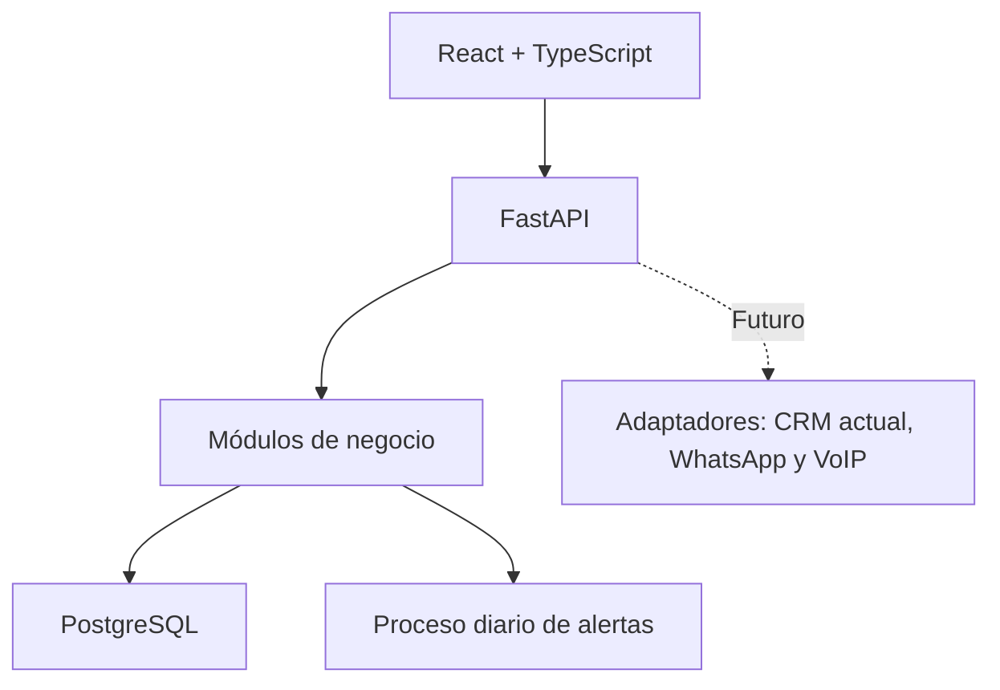

# Plan de desarrollo — CRM interno de fidelización

## 1. Objetivo y alcance del MVP

El sistema será una capa interna de fidelización y recompra que operará junto al CRM actual. El asesor continuará realizando sus ventas, llamadas y comunicaciones por WhatsApp desde el sistema habitual; en este CRM registrará ventas y gestionará oportunidades de recompra.

El MVP incluye:

- Gestión de clientes.
- Gestión de productos y reglas de recompra.
- Gestión de usuarios y permisos.
- Importación masiva de clientes y productos mediante plantillas Excel.
- Registro manual de ventas.
- Alertas automáticas de recompra.
- Paneles de seguimiento y reportería.

El MVP excluye inventario, pagos, integración con WhatsApp, telefonía VoIP, automatización de mensajes y reemplazo del CRM actual.

## 2. Roles y permisos

| Acción | Asesor | Supervisor | Administrador |
|---|:---:|:---:|:---:|
| Iniciar sesión | ✓ | ✓ | ✓ |
| Buscar cliente por DNI | ✓ | ✓ | ✓ |
| Crear cliente | ✓ | ✓ | ✓ |
| Editar datos de cliente | Solo datos básicos de sus registros | ✓ | ✓ |
| Registrar ventas | Solo propias | Consulta | ✓ |
| Corregir o anular ventas | — | ✓ | ✓ |
| Tipificar contactos y alertas | Solo propias | Consulta y seguimiento | ✓ |
| Ver indicadores y reportes | Solo personales | ✓ | ✓ |
| Configurar productos y reglas de recompra | — | ✓ | ✓ |
| Importar clientes y productos masivamente | — | ✓ | ✓ |
| Reasignar cartera y alertas | — | ✓ | ✓ |
| Gestionar usuarios, roles y credenciales | — | — | ✓ |
| Eliminar o desactivar datos | — | — | ✓ |

La eliminación debe ser principalmente **lógica**: un cliente o producto se marca como inactivo, pero se conserva su historial de ventas, alertas y auditoría. La eliminación física solo se permite para registros sin relaciones o mediante un procedimiento administrativo controlado.

Aunque el supervisor registrará o modificará reglas de productos, las reglas de duración y recompra deben responder a una aprobación médica previa. El sistema debe registrar quién cambió la regla y cuándo.

## 3. Arquitectura y tecnologías

Se implementará un **monolito modular**: una aplicación desplegable con módulos internos independientes. Esto reduce complejidad en el MVP y permite escalar posteriormente mediante adaptadores de integración.



### Tecnologías

- **Frontend:** React, TypeScript, Vite, React Router, TanStack Query, React Hook Form y Zod.
- **Backend:** FastAPI, SQLAlchemy 2, Pydantic y Alembic.
- **Base de datos:** PostgreSQL.
- **Autenticación:** JWT y Argon2 o bcrypt para contraseñas.
- **Pruebas backend:** Pytest.
- **Pruebas frontend:** Vitest y React Testing Library.
- **Pruebas de flujo completo:** Playwright.
- **Infraestructura:** Docker y Docker Compose.

### Estructura del backend

```text
backend/
├── app/
│   ├── core/                 # Configuración, seguridad, BD y auditoría
│   ├── modules/
│   │   ├── auth/
│   │   ├── users/
│   │   ├── customers/
│   │   ├── products/
│   │   ├── imports/
│   │   ├── sales/
│   │   ├── alerts/
│   │   └── reports/
│   ├── integrations/         # Interfaces preparadas para el futuro
│   ├── workers/              # Generación diaria de alertas
│   └── tests/
├── alembic/                  # Migraciones de PostgreSQL
└── docker-compose.yml
```

### Estructura del frontend

```text
frontend/src/
├── app/                      # Rutas, providers y configuración global
├── features/
│   ├── auth/
│   ├── customers/
│   ├── products/
│   ├── imports/
│   ├── sales/
│   ├── alerts/
│   ├── reports/
│   └── users/
├── components/               # Componentes reutilizables
├── services/                 # Cliente HTTP y servicios API
└── tests/
```

## 4. Módulos y reglas de negocio

### 4.1 Autenticación y usuarios

- Inicio y cierre de sesión.
- Recuperación y cambio de contraseña.
- Usuarios activos e inactivos.
- Roles: `ASESOR`, `SUPERVISOR` y `ADMIN`.
- Registro de auditoría para cambios sensibles.
- Al desactivar un asesor, sus ventas, contactos y alertas cerradas conservarán su autor histórico. El usuario no se eliminará.
- El supervisor o administrador podrá transferir su cartera y alertas activas a otro asesor o a una cola de recuperación. El cambio registrará asesor anterior, nuevo responsable, motivo, fecha y usuario que lo realizó.

### 4.2 Clientes

Campos mínimos:

- DNI único.
- Nombres y apellidos.
- Teléfono y correo.
- Estado del cliente.
- Asesor responsable actual de la cartera, si corresponde.

El asesor buscará primero por DNI. Si el cliente no existe, podrá crearlo desde el formulario de venta. El asesor podrá editar únicamente datos básicos de los clientes de su cartera actual; no podrá modificar ventas históricas ni asignaciones. Las alertas son tareas internas: el sistema no envía mensajes, correos ni llamadas al cliente. El asesor decide el canal y la oportunidad de contacto, y registra el canal utilizado después de realizar la gestión.

### 4.3 Productos y reglas de recompra

Cada producto contará con:

- Código único, nombre, categoría y estado.
- Duración estimada en días.
- Días previos de alerta, por ejemplo 15 y 5 días.
- Fecha de vigencia de la regla.
- Usuario que creó o modificó la configuración.
- Referencia, responsable y fecha de aprobación médica.

No se almacenarán diagnósticos, recetas ni detalles clínicos en el MVP. Solo se utilizará la lógica comercial aprobada para la recompra.

### 4.4 Ventas

Una venta incluirá:

- Cliente.
- Asesor que la registra.
- Fecha de venta.
- Canal de captación en la primera venta del cliente: `TV`, `DIGITAL` u `OTROS`.
- Uno o varios productos.
- Cantidad por producto.
- Observación opcional.

Al registrar una venta, el sistema guardará una copia de la regla vigente aplicada a cada producto. Así, si se modifica posteriormente la duración estimada, las ventas históricas no se recalcularán de manera incorrecta. La cantidad vendida se conserva para análisis comercial, pero no altera la duración ni las fechas de alerta.

En la primera venta confirmada de un cliente, el canal de captación es obligatorio. Se guardará tanto en la venta que originó el cliente como en su ficha, y no se reemplazará con las recompras posteriores. Los valores iniciales son `TV`, `DIGITAL` y `OTROS`; este último exige una descripción. Un cliente importado sin ventas deberá completar este dato al registrar su primera venta.

La clasificación de compra pertenece a cada producto vendido, no a la cabecera de venta. La primera venta de un cliente para un producto se marcará como `COMPRA`; cada venta posterior de ese mismo cliente y producto se marcará como `RECOMPRA`, incluso si fue registrada por otro asesor. Cada recompra guardará la referencia al producto vendido anterior para calcular el promedio de días entre compras por cliente, producto y asesor.

Una venta confirmada no se editará directamente. El supervisor o administrador podrá anularla con motivo y, si corresponde, registrar una venta de reemplazo. La anulación conserva el registro, cancela sus alertas como `CANCELADO_POR_ANULACION` y recalcula la secuencia de compra/recompra y los ciclos activos del cliente-producto a partir de las ventas restantes. Las ventas anuladas no participan en métricas ni en la generación de alertas.

Antes de confirmar una venta, el sistema detectará como posible duplicado una venta existente del mismo cliente, producto y fecha de venta. Mostrará el detalle para evitar doble registro; si se confirma que ambas ventas son reales, quedará en estado `PENDIENTE_REVISION_DUPLICADO` hasta que el supervisor o administrador apruebe la excepción con un motivo auditado. Solo las ventas `CONFIRMADAS` generan alertas y participan en la clasificación de compra/recompra. Esta validación es obligatoria porque la venta se registra también en el CRM actual.

Para una venta registrada con fecha pasada, el sistema calcula sus fechas originales. No crea múltiples alertas atrasadas: si la fecha estimada de recompra aún está dentro de la ventana activa, crea una sola alerta inmediata para hoy; si ya superó la ventana activa, la registra como `VENCIDO_NO_GESTIONADO` para consulta histórica. Las alertas futuras que resulten de esa venta se programan normalmente.

Ejemplo:

```text
Producto: Colágeno
Fecha de venta: 1 de octubre
Duración aplicada: 30 días
Fecha estimada de recompra: 31 de octubre
Alertas: 16 y 26 de octubre
```

### 4.5 Importación masiva

El supervisor y administrador podrán descargar plantillas Excel separadas para clientes y productos. Las plantillas incluirán una hoja de instrucciones, columnas obligatorias claramente identificadas y ejemplos ficticios.

- **Clientes:** DNI, nombres, apellidos, teléfono, correo y asesor responsable opcional.
- **Productos:** código, nombre, categoría, duración estimada en días, días previos de alerta, fecha de vigencia, referencia de aprobación médica y estado.
- El sistema validará el archivo antes de confirmar la importación: encabezados, formatos, campos obligatorios, DNI duplicados dentro del archivo y conflictos con registros existentes.
- Se mostrará una vista previa con cantidades de filas válidas, nuevas, actualizables y rechazadas. Las filas con error podrán descargarse con el motivo específico para su corrección.
- La importación será atómica por lote: si existen errores de validación, no se importará ninguna fila hasta que el archivo se corrija. Las actualizaciones de registros existentes requerirán una opción explícita de confirmación.
- Cada lote conservará archivo de origen, fecha, usuario responsable, resultado, número de filas procesadas y detalle de errores en la auditoría.
- Solo se aceptarán archivos `.xlsx` sin macros, dentro de los límites configurados de tamaño y número de filas. Se rechazarán fórmulas en campos de datos y archivos protegidos o corruptos.
- Una actualización no borra valores existentes con una celda vacía. La plantilla identificará los campos actualizables; el DNI identifica clientes y el código único identifica productos.
- La reasignación de cartera por importación será una acción explícita y solo se aceptará si el asesor destino está activo; generará el mismo historial de transferencia que la reasignación manual.
- Un cambio importado de duración, alertas o vigencia crea una nueva regla con fecha de vigencia y requiere la aprobación registrada; no modifica la regla histórica directamente.
- No se importarán ventas ni alertas en el MVP mediante este módulo. Los productos importados quedarán sujetos a las mismas reglas de aprobación y auditoría que los creados manualmente.

### 4.6 Alertas y fidelización

Estados de alerta:

- Pendiente.
- Contactado.
- Reprogramado.
- Recompra lograda.
- Sin respuesta.
- No interesado.
- Cancelado por recompra.
- Cancelado por anulación.
- Vencido no gestionado.

Los estados `RECOMPRA_LOGRADA`, `NO_INTERESADO`, `CANCELADO_POR_RECOMPRA`, `CANCELADO_POR_ANULACION` y `VENCIDO_NO_GESTIONADO` son finales. `SIN_RESPUESTA` conserva el número de intentos y una próxima acción, por lo que aún puede ser reasignado o atendido. Al indicar que el cliente todavía dispone del producto, el asesor reprogramará la alerta con una fecha concreta de seguimiento; esta permanecerá activa.

La administración configurará, antes de producción, la ventana activa posterior a la fecha estimada de recompra, máximo de intentos, separación mínima entre intentos, antigüedad máxima sin gestión y días de atraso de una próxima acción. Una alerta reprogramada permanece activa hasta su próxima acción; si esta vence por encima del límite configurado, pasa a la cola de recuperación para decisión del supervisor. Estos parámetros se auditan y no se codifican como valores fijos.

Reglas principales:

1. Un proceso diario identifica ventas próximas a recomprar.
2. Crea las alertas configuradas sin duplicarlas, vinculadas a un producto vendido específico (`sale_item`). Un cliente con productos de distinta duración tendrá alertas independientes por producto.
3. Asigna inicialmente cada alerta al asesor responsable actual del cliente; si no existe, se usa el asesor que registró la venta siempre que esté activo. En otro caso, se envía a la cola de recuperación del supervisor.
4. Si se registra una recompra del mismo cliente y producto desde una alerta activa, esa alerta queda como `RECOMPRA_LOGRADA` y las demás alertas activas de las ventas anteriores de ese producto quedan como `CANCELADO_POR_RECOMPRA`, sin eliminarse. Si la recompra se registra manualmente sin seleccionar una alerta, todas las alertas activas anteriores se cancelan. La venta nueva genera el único ciclo de alertas activo para esa combinación de cliente y producto.
5. Una interacción puede actualizar varias alertas del mismo cliente, conservando resultado, nota y próxima acción independientes por producto.
6. El asesor visualiza tarjetas priorizadas: vencidas recientes, para hoy, próximas y reprogramadas. Las alertas sin gestión ni reprogramación pasan a `VENCIDO_NO_GESTIONADO` y salen de la bandeja activa al finalizar la ventana activa configurada después de su fecha estimada de recompra; se conservan para consulta, reportes y auditoría.
7. Las alertas activas asignadas a un usuario inactivo, o las que superen la antigüedad o intentos máximos configurados, pasan a la cola de recuperación para que el supervisor las reasigne.
8. Cada contacto deja fecha, canal, resultado, nota y próxima acción.

### 4.7 Tipificación de contactos

La tipificación es un resultado estructurado de cada intento de contacto, independiente del estado de la alerta. El asesor seleccionará un canal usado: `LLAMADA`, `WHATSAPP`, `EMAIL` u `OTRO`; el sistema no envía ninguna comunicación al cliente.

El catálogo inicial de resultados será fijo para asegurar reportes comparables:

- `RECOMPRA_REGISTRADA`: exige una nueva venta confirmada del mismo producto y cierra la alerta como recompra lograda.
- `AUN_TIENE_PRODUCTO`: exige una fecha de próxima acción y reprograma la alerta.
- `SOLICITA_SEGUIMIENTO`: exige una fecha de próxima acción y reprograma la alerta.
- `SIN_RESPUESTA`: incrementa el intento y exige una próxima acción.
- `NO_INTERESADO`: cierra la alerta.
- `DATOS_DE_CONTACTO_INCORRECTOS`: envía la alerta a la cola de recuperación para corrección o reasignación.
- `OTRO`: exige una nota descriptiva y una decisión sobre próxima acción o cierre.

Un mismo contacto puede tener resultados distintos por cada producto/alerta seleccionado. Los cambios de resultado y estado son auditables.

### 4.8 Reportería

El supervisor y administrador podrán consultar:

Las métricas se calcularán solo con ventas confirmadas y alertas no anuladas. La tasa de contacto es el porcentaje de alertas con fecha programada en el periodo que tienen al menos un resultado de contacto efectivo (`RECOMPRA_REGISTRADA`, `AUN_TIENE_PRODUCTO`, `SOLICITA_SEGUIMIENTO`, `NO_INTERESADO` u `OTRO`), excluyendo alertas canceladas. La tasa de recompra es el porcentaje de productos vendidos cuya fecha estimada de recompra cae en el periodo y que tienen una recompra válida dentro de la ventana configurada. Los reportes deben separar asesor que registró la venta, responsable actual de cartera y asesor que gestionó la alerta.

- Alertas pendientes, vencidas y atendidas.
- Alertas y recompras por asesor.
- Tasa de contacto.
- Tasa de recompra.
- Contactos y resultados de tipificación por asesor, producto y canal utilizado.
- Ventas y recompras por producto.
- Ventas, recompras y tasa de recompra por canal de captación.
- Promedio de días entre compras por producto, cliente y asesor.
- Clientes sin recompra después de la fecha estimada.
- Cartera y alertas reasignadas, pendientes de recuperación y sin respuesta.
- Rendimiento por periodo.
- Exportación a Excel o CSV.

## 5. Modelo de datos mínimo

| Entidad | Campos o propósito principal |
|---|---|
| `users` | Usuarios, credenciales cifradas, rol y estado. |
| `customers` | DNI, datos de contacto, canal de captación inicial, estado y asesor responsable actual. |
| `products` | Catálogo de productos y estado. |
| `product_repurchase_rules` | Duración, días de alerta, vigencia, configuración y referencia de aprobación médica. |
| `sales` | Cabecera de venta: cliente, asesor que registró, fecha, canal de captación si es primera venta, alerta de origen opcional, estado y motivo de anulación. |
| `sale_items` | Productos vendidos, cantidad, copia de la regla, tipo compra/recompra y referencia al producto vendido anterior. |
| `sales_duplicate_reviews` | Posibles duplicados, decisión, motivo, aprobador y fecha. |
| `alerts` | Alerta vinculada a un `sale_item`, fecha programada, fecha estimada de recompra, asesor asignado, estado, resultado y motivo de cierre. |
| `contact_attempts` | Historial de contactos: alerta, asesor, fecha, canal usado, resultado tipificado, nota, número de intento y próxima acción. |
| `alert_assignments` | Historial de reasignaciones de alertas: origen, destino, motivo, fecha y usuario responsable. |
| `customer_assignments` | Historial de transferencias de cartera: asesor anterior, nuevo responsable, motivo, fecha y usuario responsable. |
| `import_jobs` | Lote importado, tipo, usuario, archivo, estado y totales. |
| `import_row_errors` | Errores de validación por fila para descarga y corrección. |
| `system_settings` | Parámetros auditables de seguimiento, vencimiento y recuperación. |
| `audit_log` | Registro de cambios relevantes del sistema. |

Restricciones de integridad mínimas:

- DNI y código de producto únicos.
- Una alerta no se puede crear dos veces para el mismo `sale_item` y fecha programada.
- La confirmación de una recompra y la cancelación de alertas del ciclo anterior se ejecutan en una única transacción.
- Una venta anulada no puede volver a confirmar ni originar una alerta.

## 6. Plan de desarrollo por sprints

| Sprint | Objetivo | Entregable |
|---|---|---|
| 0 | Diseño funcional | Historias de usuario, reglas, wireframes y modelo de datos aprobado. |
| 1 | Base técnica | Repositorio, Docker, PostgreSQL, migraciones, login y roles. |
| 2 | Clientes y productos | CRUD, búsqueda por DNI, reglas de recompra, importación Excel y auditoría. |
| 3 | Ventas | Registro de ventas, múltiples productos, compra/recompra, duplicados, anulación e historial del cliente. |
| 4 | Alertas | Cálculo por producto, proceso automático, ciclos de recompra, ventas atrasadas, parámetros configurables, vencimiento y panel del asesor. |
| 5 | Supervisión | Reasignación de cartera, cola de recuperación, indicadores, filtros, reportes y exportación. |
| 6 | Pruebas completas | Pruebas automatizadas, correcciones y datos de prueba. |
| 7 | Piloto y producción | Capacitación, despliegue, monitoreo y respaldo inicial. |

Estimación: 8 a 10 semanas a tiempo completo. Si el desarrollo se realiza junto a otras responsabilidades, es más realista estimar entre 3 y 4 meses.

## 7. Plan de pruebas antes de producción

| Módulo | Casos mínimos a validar |
|---|---|
| Autenticación | Credenciales válidas e inválidas, contraseña cifrada, sesión expirada y acceso denegado por rol. |
| Usuarios | Solo admin crea usuarios, desactivación, cambio de rol, conservación del historial y auditoría. |
| Clientes | DNI obligatorio y único, búsqueda correcta, prevención de duplicados, reasignación y desactivación sin perder historial. |
| Productos | Solo supervisor/admin configura reglas, código único, duración y días de alerta válidos, y producto inactivo no vendible. |
| Importación | Plantillas descargables, validación de encabezados, formatos, tamaño y macros, detección de duplicados, vista previa, rechazo atómico, actualizaciones explícitas, reglas aprobadas, reasignación auditada, errores descargables y auditoría del lote. |
| Ventas | Asesor registra solo sus ventas, múltiples productos, transacción atómica, canal obligatorio en primera venta, copia correcta de la regla, clasificación compra/recompra, detección de duplicados, anulación y recálculo de ciclos. |
| Alertas | Fechas correctas por producto, cantidad sin efecto en duración, ventas atrasadas, ausencia de duplicados, cierre de alerta origen y cancelación de las demás por recompra o anulación, reprogramación, vencimiento configurable, contacto múltiple y tipificación. |
| Tipificación | Catálogo de resultados, canal registrado sin envío automático, reglas de cierre o próxima acción, nota obligatoria para `OTRO` y resultados independientes por alerta. |
| Reasignación | Transferencia de cartera y alertas activas, cola para usuarios inactivos, conservación de autor histórico e historial auditable de cada cambio. |
| Reportería | Fórmulas documentadas para tasas, exclusión de ventas anuladas, métricas por canal de captación, promedio de recompra, atribución separada por asesor, filtros por fecha/asesor/producto, acceso restringido y exportación válida. |
| Auditoría | Registro de cambios en clientes, productos, usuarios y configuraciones. |
| Frontend | Formularios validados, errores entendibles, navegación y permisos visuales. |
| Seguridad | Autorización en endpoints, validación de entradas, secretos fuera del código y pruebas de acceso indebido. |
| Flujo completo | Crear cliente → registrar venta → generar alerta → tipificar → registrar recompra. |

### Tipos de prueba

- **Unitarias:** validan reglas aisladas, por ejemplo el cálculo de la fecha de recompra.
- **Integración:** validan endpoints, base de datos, permisos y transacciones.
- **Interfaz:** validan formularios y componentes React.
- **End-to-end:** validan el flujo completo como lo ejecutaría un asesor.
- **Regresión:** se ejecutan antes de cada despliegue para confirmar que cambios nuevos no rompen funciones existentes.

## 8. Flujo de desarrollo con inteligencia artificial

1. Definir historia de usuario y criterios de aceptación.
2. Crear primero los casos de prueba del módulo.
3. Usar IA para proponer código, consultas, pruebas y revisiones.
4. Ejecutar pruebas localmente.
5. Revisar manualmente permisos, validaciones y reglas de negocio.
6. Trabajar con ramas pequeñas: una funcionalidad por rama.
7. Integrar cambios solo si el pipeline de pruebas pasa correctamente.

Nunca deben enviarse a herramientas de IA externas datos reales de clientes, DNI, teléfonos ni información asociada a su salud. Para desarrollo y pruebas se usarán datos ficticios o anonimizados.

## 9. Despliegue y operación

Antes de producción deben existir tres entornos:

- **Desarrollo:** trabajo local y pruebas iniciales.
- **Pruebas / staging:** validación integrada con datos ficticios.
- **Producción:** uso real por asesores.

Requisitos operativos mínimos:

- Variables de entorno para secretos y configuración.
- HTTPS.
- Copias de seguridad periódicas de PostgreSQL.
- Migraciones controladas con Alembic.
- Registro de errores y monitoreo básico.
- Usuario administrador inicial creado de forma segura.

## 10. Evolución posterior al MVP

Cuando el MVP sea estable, se podrán desarrollar adaptadores sin modificar el núcleo de clientes, ventas o alertas:

1. Integración con el CRM actual para evitar doble registro.
2. Integración de WhatsApp para registrar comunicaciones y, posteriormente, automatizar mensajes autorizados.
3. Integración con VoIP para registrar llamadas y resultados.
4. Automatizaciones más avanzadas de asignación de alertas.
5. Reemplazo gradual de funcionalidades del CRM actual, solo cuando la operación lo justifique.

## 11. Criterio de salida a producción

El MVP estará listo cuando:

- Un asesor pueda crear o encontrar un cliente por DNI.
- Un asesor pueda registrar una venta con uno o más productos.
- El sistema calcule y genere alertas correctas de recompra.
- El asesor pueda tipificar el resultado de contacto.
- El supervisor pueda monitorear actividad e indicadores.
- El administrador pueda gestionar accesos, productos y configuraciones.
- Las ventas duplicadas, anuladas y con fecha pasada se gestionen sin perder trazabilidad ni generar ciclos erróneos.
- La importación, reasignación de cartera, recuperación de alertas y tipificación estén validadas en staging.
- Todas las pruebas críticas pasen en el entorno de staging.
