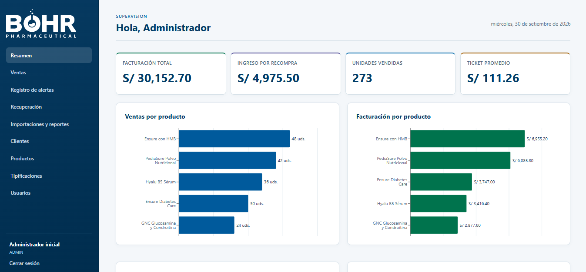
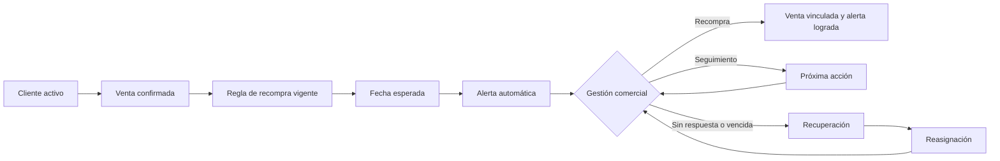

# CRM Repurchase BOHR

CRM para gestionar el ciclo de recompra de BOHR Pharmaceutical. Centraliza ventas, alertas de recompra, gestión comercial, recuperación, reasignaciones, importación histórica y reportes operativos.

<p align="center">
  
</p>

## Capacidades

- Registro de clientes con cartera responsable, UBIGEO y datos de contacto.
- Catálogo de productos, marcas, categorías y reglas versionadas de recompra.
- Ventas con precios preservados, cadena compra/recompra y detección de duplicados.
- Alertas automáticas, tipificaciones, próximas acciones y recuperación comercial.
- Transferencia de cartera y reasignación de alertas con auditoría.
- Importaciones Excel de clientes, productos y ventas históricas idempotentes.
- Reportes Excel, métricas por asesor y paneles de supervisión.

## Flujo Principal



## Inicio Rápido

### Requisitos

- Docker Engine con Docker Compose v2.
- Para ejecución sin Docker: Python 3.13+, Node.js 22+ y PostgreSQL 17.

### Con Docker

```bash
git clone https://github.com/Qazowned05/crm-repurchase-bohr.git
cd crm-repurchase-bohr
cp .env.example .env
docker compose up --build
```

Servicios locales:

| Servicio | Dirección |
| --- | --- |
| Frontend | http://localhost:5173 |
| API y OpenAPI | http://localhost:8001/docs |
| Salud de API | http://localhost:8001/health |
| PostgreSQL | localhost:5432 |

Configura `INITIAL_ADMIN_EMAIL` e `INITIAL_ADMIN_PASSWORD` en `.env` antes del primer arranque.

## Documentación

- [Arquitectura y modelo de datos](docs/ARCHITECTURE.md)
- [Flujo operativo completo](docs/OPERATIONS.md)
- [Despliegue, seguridad y mantenimiento](docs/DEPLOYMENT.md)

## Calidad

```bash
cd backend && python -m pytest
cd frontend && npm test
cd frontend && npm run format:check
cd frontend && npm run build
```

La integración continua ejecuta las pruebas backend y frontend, formato y compilación en cada push y pull request.
