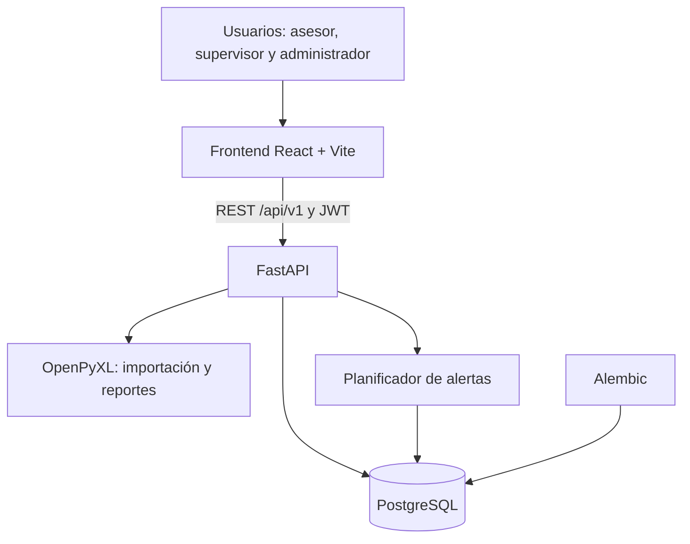
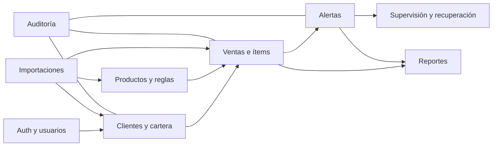
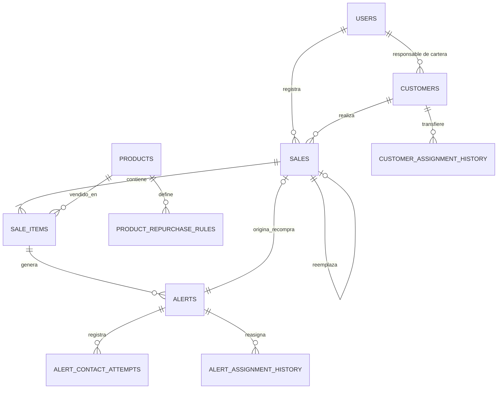

# Arquitectura

## Componentes

| Capa | Tecnología | Responsabilidad |
| --- | --- | --- |
| Interfaz | React 19, TypeScript, Vite, Recharts | Operación, paneles, formularios y descargas. |
| API | FastAPI, Pydantic, SQLAlchemy | Autenticación, reglas de negocio y autorización por rol. |
| Persistencia | PostgreSQL 17 | Datos operativos, auditoría e historial de asignaciones. |
| Migraciones | Alembic | Evolución controlada del esquema. |
| Archivos | OpenPyXL | Plantillas, previsualización de Excel y reportes operativos. |
| Entorno | Docker Compose, Nginx | Ejecución local y despliegue. |

## Módulos Del Backend

## Modelo De Datos

### Invariantes Relevantes

- Un DNI identifica a un único cliente.
- Una venta histórica usa `numero_venta` como referencia externa única e idempotente.
- Cada ítem conserva precio unitario, regla y fecha esperada aplicados en el momento de la venta.
- Una alerta solo puede vincular una recompra del producto esperado.
- Alertas, contactos y reasignaciones quedan auditados.
- Ventas con historial de alertas o recompra no permiten cambios destructivos en fecha o productos; se anulan y reemplazan.

## Seguridad

La API usa JWT con expiración. Los asesores están restringidos a su cartera para clientes, ventas y alertas; supervisores y administradores acceden a operación y reportes. El frontend nunca almacena contraseñas, solo el token de sesión en almacenamiento local.
