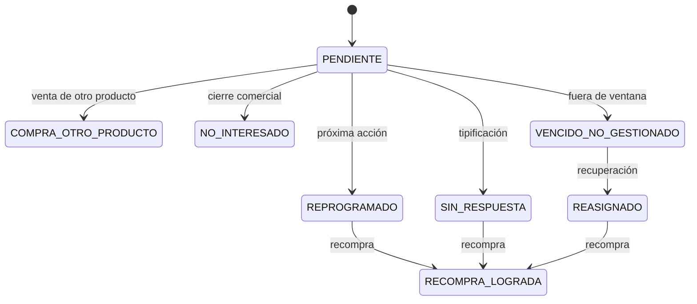
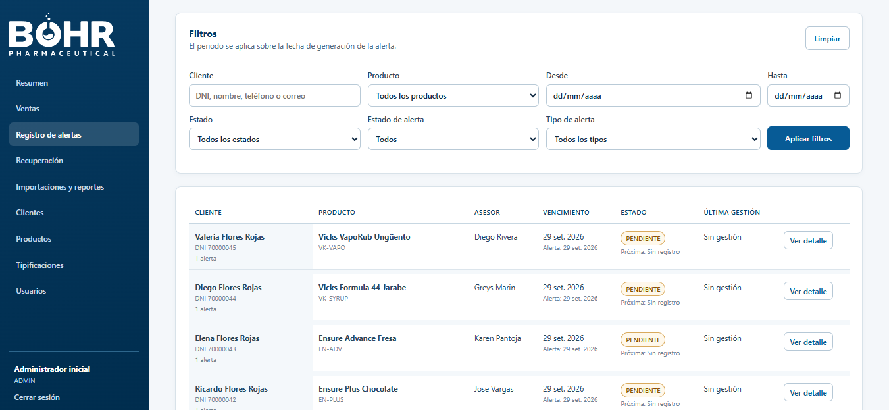
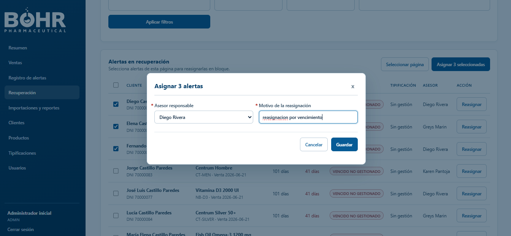

# Flujo Operativo

## Roles

| Rol | Alcance |
| --- | --- |
| Asesor | Gestiona su cartera, registra ventas y atiende alertas asignadas. |
| Supervisor | Supervisa resultados, recuperación, transferencias, importaciones y reportes. |
| Administrador | Incluye supervisión y administra usuarios, productos, reglas, tipificaciones y configuración. |

## Ciclo Completo

### 1. Preparación

1. El administrador crea asesores activos.
2. Crea marcas, categorías y productos.
3. Define reglas de recompra con duración y días de alerta, vigentes desde una fecha.
4. Registra clientes y asigna la cartera a un asesor activo.

### 2. Venta Y Cadena De Recompra

1. El asesor selecciona un cliente de su cartera, fecha, canal y productos.
2. El sistema guarda el precio y la regla que estaban vigentes para cada ítem.
3. La primera compra se clasifica como `COMPRA`; compras posteriores del mismo producto se enlazan como `RECOMPRA`.
4. Si una venta debe corregirse después de que existan alertas o recompras, se anula y se registra una venta de reemplazo para no perder historia.

### 3. Generación Y Gestión De Alertas

La aplicación genera alertas al cumplirse la fecha esperada. El asesor registra contactos, tipificaciones, notas y próxima acción. Las alertas vencidas o sin respuesta pasan a la vista de recuperación para que supervisión las reasigne.

  

### 4. Reasignación Y Recuperación

La transferencia de cartera reasigna sus alertas activas y registra el asesor anterior, el nuevo, el motivo y el actor. La recuperación también permite reasignar alertas individualmente o en lote sin cambiar la propiedad de la cartera.

  

### 5. Recompra Y Métricas

Una recompra registrada desde una alerta cierra esa alerta como lograda y cancela los ciclos competidores del mismo producto. Los reportes identifican las recompras logradas después de una reasignación.

  

## Importaciones

La vista **Importaciones y reportes** permite descargar plantillas y validar un archivo antes de confirmarlo. Se admiten clientes, productos y ventas históricas.

| Tipo | Clave | Comportamiento |
| --- | --- | --- |
| Clientes | DNI | Crea o actualiza según permisos seleccionados. |
| Productos | Código | Valida catálogos y reglas de recompra. |
| Ventas históricas | `numero_venta` | Es idempotente, conserva el precio histórico técnico cuando se provee y genera alertas dentro de la misma transacción. |

## Paneles Y Reportes

Los paneles presentan ventas, facturación, recompra, productos, alertas y ranking de asesores. El reporte operativo Excel consolida ventas, alertas y gestiones filtradas.

  

